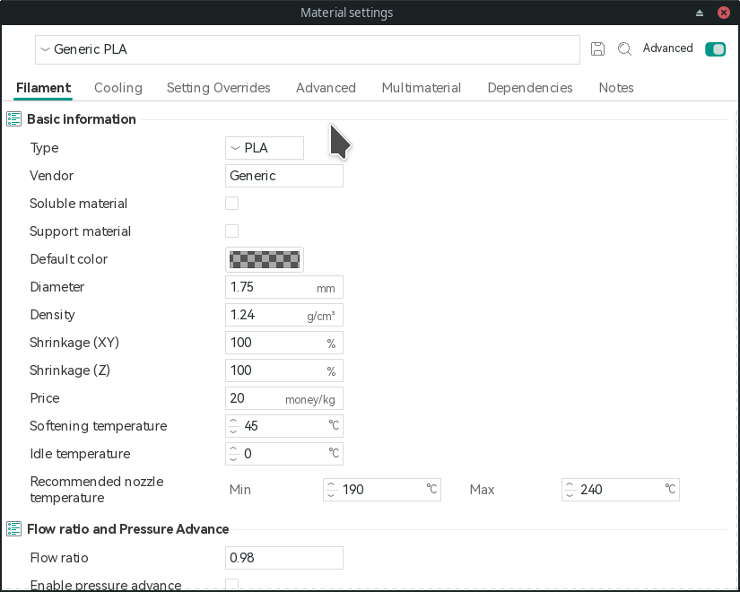

# What
This repo contains all machine, filament, and process configuration files found in Bambu Studio along side a combined version of the configs in cases where they inherit from other configs.

# Why
The current machines only support four nozzle sizes: 0.2mm, 0.4mm, 0.6mm, 0.8mm
If we want to use different nozzle sizes we will have to come up with our own profiles and these existing configs can help determine the settings for other files.
This repo also helps easily identify what the differences are between such configuration files.

# How
The Bambu Studio (and Orca Slider and probably other PrusaSlicer derivatives) store native configs at:
- “C:\Users\USERNAME\AppData\Roaming\BambuStudio\user\default\filament\base
Newly created configs are store at
- “C:\Users\USERNAME\AppData\Roaming\BambuStudio\user\default\filament\base

I've simply copied the whole `system` folder and removed any non-json files from it.

I've then run `create_combined_files.py` to produce files which check if an `inherits` key exists in the current config. 
If it does then it will load that parent config and apply the current config to the parent overwriting any values it had. This process is recursive.

Another thing it does is split up any values that come from a `_gcode` key. 
This is done so that we can more easily compare gcodde commands as they will now be listed line by line.
This does mean that we cannot directly use a `combined` file as a replacement

# Notes and Weird Stuff
## General
- If a file does not have a nozzle size but other do, assume it's meant for a 0.4 nozzle (or 0.4 + 0.6)

## Filament
These are the different filament/material profiles that are built in.

Not very useful besides seeing what differences a `Generic` and other brand filament have.

Covers settings under:
- Filament
- Cooling
- Settings Overrides
- Advanced
- Multimaterial
- Dependencies

Most changes done here will be regarding flow ratio, pressure advance, filament temps...

Example: `combined_generic_pla` vs `combined_bambu_pla_basic@bbl_x1c` (which should apply only to 0.4/6 nozzles are this config has separate files for 0.2)

- For some reason P1P is split off into its own folder
- For some reason 0.2 nozzles and 0.4/6/8 nozzle use different config, no idea why latter can be grouped up
- 0.8 nozzles sometimes have also different config files

## Machine
These are for machine setups i.e. what nozzle you have attached to the machine

Covers settings under:
- Basic Info
- Machine Gcode
- Multimaterial
- Extruder
- Motion Ability

The Extruder tab is where most changes will take place as well some gcode edits

## Process
These are for the different print/layer settings that will be used

# TODO
- [ ] App for showing diffs between files
- [ ] Script for outputting a proper config file that deals with `inherits` and `_gcode` keys
- [ ] Remove `inherits` in combined files
- [ ] Get all the configs from Bambu Studio
- [ ] Add extra info about the configs, i.e. names, weird stuff (0.2 treated differently that 0.4/6/8)
- [ ] Add info on modifications needed to get one of these profiles working
- [ ] Test out adding additional nozzle sizes to native Bambu Studio configs i.e. `BBL.json`
